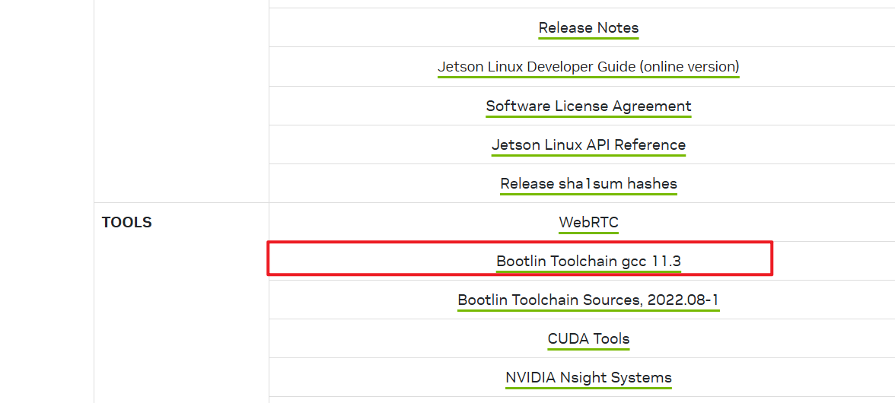

# QMiniSimAndDeploy

将QMini部署在PC, JestonNano, RaspberryPi 等仿真或者嵌入式平台上
本项目参考 https://github.com/vsislab/RoboTamerSdk4Qmini.git 在上面做了修改

## 1 编译部分

### 1.1 x86 PC 编译
``` bash
mkdir build_x86_64
cd build_x86_64
cmake .. -DCMAKE_INSTALL_PREFIX=../install/x64/
make
make install
```

### 1.2 aarch64 交叉编译

#### 1.2.1 下载交叉编译工具链
这里按照 Jetson Orin Nano 为例
下载官方的交叉编译工具链：https://developer.nvidia.com/embedded/jetson-linux-r3644

下载下来以后解压到 path/to/your/aarch64toolchain/ 里面


#### 1.2.2 获得目标板的 rootfs

方式1: 最简单，和目标板在同一个局域网内，使用 sshfs 挂在目标板的根文件系统
``` bash
sshfs -p 22 qmini@10.168.1.160:/ jetson_nano_rootfs/
```

#### 1.2.3 cmake 交叉编译 toolchain 文件

以 cmake_toolchain/toolchain-JetsonNano.cmake 为例
修改下面 2 行
``` bash
set(CROSS_COMPILE_PREFIX "path/to/your/aarch64toolchain/path_to_aarch64-buildroot-linux-gnu-路径")
set(CMAKE_SYSROOT "jetson_nano_rootfs路径")
```

#### 1.2.4 编译步骤
``` bash
mkdir build_aarch64
cd build_aarch64
cmake \
      -DCMAKE_TOOLCHAIN_FILE=../cmake_toolchain/toolchain-JetsonNano.cmake \
      -DCMAKE_INSTALL_PREFIX=../install/aarch64/ \
      ..
make
make install
```

#### 1.2.5 拷贝编译文件到目标板
scp -r install/ xmini@10.168.1.160:/期望安装的文件夹


## 2 运行
### 2.1 x86_64
x86_64 在电脑上直接运行即可

``` bash
export LD_LIBRARY_PATH=$LD_LIBRARY_PATH:install/x86_64/lib/
.install/x86_64/bin/run_interface
```

### 2.2 aarch64
ssh qmini@10.168.1.160
// 给串口加权限
``` bash
cd /home/qmini/Programs
export LD_LIBRARY_PATH=$LD_LIBRARY_PATH:install/aarch64/lib/
./install/aarch64/bin/run_interface
```


## 3 编译第三方库(这部分已经预编译了，不用做了)
### 3.1 交叉编译 third_party
#### 3.1.1 挂载和卸载 sshfs

挂载
``` bash
sshfs -p 22 qmini@10.168.1.160:/ jetson_nano_rootfs/
```

卸载
``` bash
umount jetson_nano_rootfs/
或者
umount -f jetson_nano_rootfs/
```

#### 3.1.2 eigen
``` bash
cd third_party/eigen
mkdir build
cd build
cmake \
    -DCMAKE_TOOLCHAIN_FILE=../../../cmake_toolchain/toolchain-JetsonNano.cmake \
    -DCMAKE_INSTALL_PREFIX=../../../install/aarch64/ \
    ..
make
make install
```

#### 3.1.3 jsoncpp
``` bash
cd third_party/jsoncpp
mkdir build
cd build
cmake \
    -DCMAKE_TOOLCHAIN_FILE=../../../cmake_toolchain/toolchain-JetsonNano.cmake \
    -DCMAKE_INSTALL_PREFIX=../../../install/aarch64/ \
    -DJSONCPP_WITH_TESTS=OFF \
    ..
make
make install
```

#### 3.1.4 onnxruntime
这个没有源码，只有预编译的，手工拷贝
在 install/aarch64/include 创建 onnx 文件夹
将 third_party/onnxruntime/aarch64/include 中的文件和文件夹拷贝到 install/aarch64/include/onnx 中
将 third_party/onnxruntime/aarch64/lib 中的 so 拷贝到 install/aarch64/lib 中

#### 3.1.5 third_party/unitree_actuator_sdk

这里也是预编译的，没有源码

将 third_party/unitree_actuator_sdk/include 里面的文件夹拷贝到 install/aarch64/include 中
将 third_party/unitree_actuator_sdk/lib/libUnitreeMotorSDK_Arm64.so 拷贝到 install/aarch64/lib 中

<!-- cd third_party/unitree_actuator_sdk
mkdir build
cd build
cmake \
    -DCMAKE_TOOLCHAIN_FILE=../../../cmake_toolchain/toolchain-JetsonNano.cmake \
    -DCMAKE_INSTALL_PREFIX=../../../install/aarch64/ \
    ..
make
make install -->


#### 3.1.6 third_party/yaml-cpp
cd third_party/yaml-cpp
mkdir build
cd build
cmake \
    -DCMAKE_TOOLCHAIN_FILE=../../../cmake_toolchain/toolchain-JetsonNano.cmake \
    -DCMAKE_INSTALL_PREFIX=../../../install/aarch64/ \
    -DYAML_BUILD_SHARED_LIBS=ON \
    -DYAML_CPP_BUILD_TESTS=OFF \
    -DYAML_CPP_BUILD_TOOLS=OFF \
    ..
make
make install


#### 3.1.7 third_party/unitree_sdk2
cd third_party/unitree_sdk2
mkdir build
cd build
cmake \
    -DCMAKE_TOOLCHAIN_FILE=../../../cmake_toolchain/toolchain-JetsonNano.cmake \
    -DCMAKE_INSTALL_PREFIX=../../../install/aarch64/ \
    ..
make
make install

### 3.1.8 复制额外的文件

调试过程中，发现 g1 相关的 include 文件在第三方依赖库中找不到，所以就手工复制过去

``` bash
cp -r install/x86_64/include/unitree/g1 install/aarch64/include/unitree/
```


