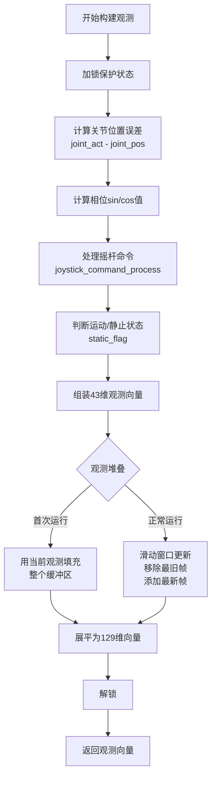
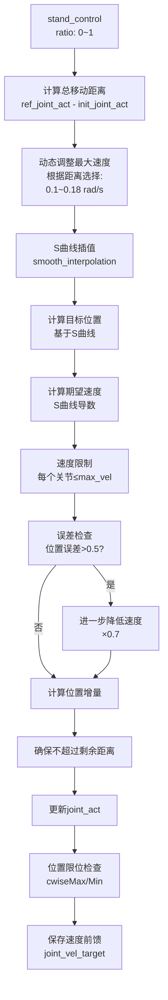
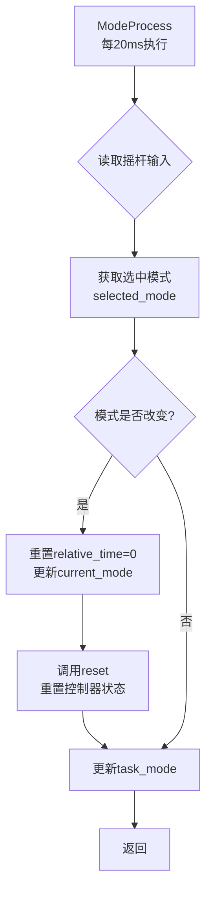
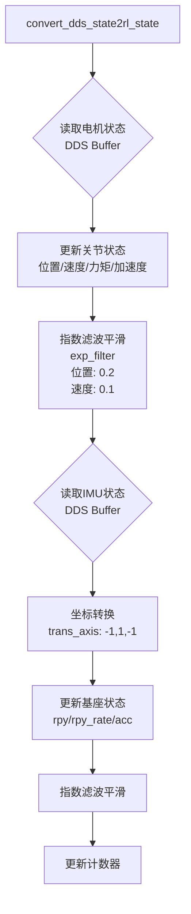

# QMini 机器人控制流程思维导图

## 整体控制架构流程图

```mermaid
flowchart TD
    Start([程序启动]) --> Init[初始化 init<br/>1. 加载ONNX模型 policy.onnx<br/>2. 初始化ONNX推理器<br/>3. 加载config.yaml参数<br/>4. 初始化状态变量<br/>5. 初始化观测堆叠缓冲区]
    
    Init --> ModeCheck[模式处理 ModeProcess<br/>检查摇杆输入<br/>判断是否需要切换模式]
    
    ModeCheck -->|模式切换| Reset[重置 reset<br/>重置状态变量<br/>初始化观测历史]
    ModeCheck -->|模式不变| Control
    
    Reset --> Control[主控制循环 Control<br/>周期: 15ms]
    
    Control --> UpdateState[状态更新 convert_dds_state2rl_state<br/>1. 读取电机状态<br/>2. 读取IMU状态<br/>3. 指数滤波平滑]
    
    UpdateState --> ModeSwitch{判断当前模式}
    
    ModeSwitch -->|模式 'q'| Exit[退出程序<br/>设置kp=kd=0]
    ModeSwitch -->|模式 'x'| Disable[电机泄力<br/>kp=kd=0<br/>保持当前位置]
    ModeSwitch -->|模式 '2'| StandControl[站立控制 stand_control<br/>平滑过渡到ref_joint_act<br/>使用S曲线插值]
    ModeSwitch -->|模式 '3'| RLControl[RL控制 rl_control<br/>ONNX模型推理]
    ModeSwitch -->|模式 '5'| SinControl[正弦测试 sin_control<br/>或模拟步态]
    ModeSwitch -->|默认 '1'| StandControl
    
    StandControl --> SmoothAction[平滑关节动作 smooth_joint_action<br/>1. S曲线插值<br/>2. 速度限制<br/>3. 误差检查<br/>4. 生成速度前馈]
    
    RLControl --> GetObs[获取观测 get_observation<br/>构建43维观测向量]
    
    GetObs --> BuildObs[组装观测向量<br/>1. 目标命令 vx,yr<br/>2. 基座姿态 roll,pitch<br/>3. 基座角速度<br/>4. 关节位置偏差<br/>5. 关节速度<br/>6. 关节位置误差<br/>7. 相位信息 sin/cos<br/>8. 频率信息]
    
    BuildObs --> StackObs[观测堆叠<br/>拼接3帧历史观测<br/>最终维度: 43×3=129]
    
    StackObs --> ONNXInference[ONNX模型推理<br/>输入: 129维观测<br/>输出: 12维动作 [-1,1]]
    
    ONNXInference --> Transform[动作转换 transform<br/>将[-1,1]映射到实际范围<br/>前2维: 相位频率增量<br/>后10维: 关节位置增量]
    
    Transform --> JointIncrement[关节增量控制 joint_increment_control<br/>1. 更新相位频率<br/>2. 计算相位<br/>3. 积分关节位置增量<br/>4. 限制在位置限位内]
    
    JointIncrement --> SmoothAction
    
    SmoothAction --> SetMotor[设置电机命令 set_rl_joint_act2dds_motor_command<br/>根据模式设置:<br/>- q_target: 目标位置<br/>- kp/kd: 刚度和阻尼<br/>- dq_target: 速度前馈]
    
    Disable --> SetMotor
    SinControl --> SetMotor
    
    SetMotor --> SendCmd[发送电机命令<br/>DDS发布到电机执行器]
    
    SendCmd --> Control
    
    Exit --> End([程序结束])
```

## 详细子流程

### 1. ONNX推理详细流程

```mermaid
flowchart LR
    A[获取观测向量] --> B[观测堆叠<br/>3帧历史]
    B --> C[ONNX模型推理<br/>输入: 129维]
    C --> D[模型输出<br/>12维, 范围[-1,1]]
    D --> E[动作转换 transform]
    E --> F[前2维: 相位频率<br/>0.5~3.5 Hz]
    E --> G[后10维: 关节增量<br/>-15~15 rad/s]
    F --> H[应用动作增量]
    G --> H
```

### 2. 观测向量构建详细流程



### 3. 站立控制详细流程



### 4. 模式切换流程



### 5. 状态更新流程



## 关键数据结构

### 观测向量 (43维)
```
[0:2]   目标命令 (vx, yr)
[2:4]   基座姿态 (roll, pitch)
[4:7]   基座角速度 (×0.5)
[7:17]  关节位置偏差 (joint_pos - ref_joint_act)
[17:27] 关节速度 (×0.1)
[27:37] 关节位置误差 (joint_act - joint_pos)
[37:41] 相位信息 (sin/cos × static_flag)
[41:43] 频率信息 ((pm_f×0.3-1) × static_flag)
```

### ONNX模型输出 (12维动作空间)
**说明**：虽然机器人只有10个关节自由度，但动作输出是12维，因为除了关节控制外，还包括步态相位频率控制。

```
[0:1]   步态相位频率增量 (0.5~3.5 Hz) - 控制左腿和右腿的步态时序频率
        - 用于周期性运动的节奏控制
        - 不直接作用于关节位置，但影响步态周期
        
[2:11]  关节位置增量 (10维) (-15~15 rad/s) - 直接控制10个关节的位置变化
        - 对应10个关节自由度
        - 这是实际作用于关节的动作
```

**动作空间组成**：12维 = 2维(步态频率) + 10维(关节增量)

### 关节动作向量 (10维)
```
实际应用到关节的动作是后10维 [2:11]，即关节位置增量
前2维 [0:1] 用于步态相位频率控制，通过compute_pm_phase()影响步态时序，
但不直接改变关节位置
```

### 关节命令
```
q_target:  目标位置 (rad)
dq_target: 目标速度 (rad/s, 用于前馈)
kp:        位置刚度系数
kd:        速度阻尼系数
tau_ff:    前馈力矩 (通常为0)
```

## 控制模式说明

| 模式 | 按键 | 功能 | task_mode |
|------|------|------|-----------|
| '1' | 默认 | 站立控制 | - |
| '2' | A | 站立控制 | - |
| '3' | LB | RL控制 | 3/4 (forward/stand) |
| '5' | SELECT | 正弦测试 | 5 |
| 'x' | X | 电机泄力 | - |
| 'q' | Q | 退出程序 | - |

## 关键参数

### 控制周期
- 主控制循环: 15ms (0.015s)
- 模式处理: 20ms (0.02s)

### 位置限位
- 从 `config.yaml` 的 `act_pos_low` 和 `act_pos_high` 读取
- 动态限制关节位置在允许范围内

### 参考位置
- `ref_joint_act`: 站立姿态的参考关节位置
- 从 `config.yaml` 读取
- 用于计算关节位置偏差

### 速度限制
- 站立控制: 0.1~0.18 rad/s (根据距离动态调整)
- RL控制: 通过位置增量限制间接控制

## 线程安全

- 使用 `pthread_mutex_t _rl_state_mutex` 保护共享状态
- 在 `get_observation()` 中加锁保护观测向量构建过程

